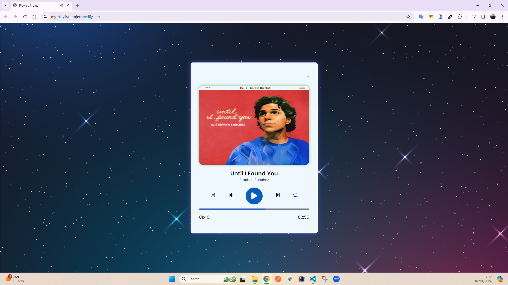

<h1>Playlist Project</h1>

In my project, there is a playlist application that I developed to maximize users' music enjoyment. Thanks to this application I designed using HTML5, CSS3, and JavaScript, users can advance and rewind the songs they want to the desired time. Additionally, they can easily shuffle the playlist and repeat any songs they want. Users can easily access the song list by clicking on the list icon to show or hide it, and adding new songs is also quite simple. This application makes the music-listening experience more enjoyable by prioritizing the user experience.

<h2> The following technologies were used in the frontend development phase of my site: </h2>

- HTML5
- CSS3
- JavaScript

<h2> Visit My Playlist Project: </h2>

- https://my-playlist-project.netlify.app/

<h4>IMAGE</h4>

<h4>VIDEO</h4>

